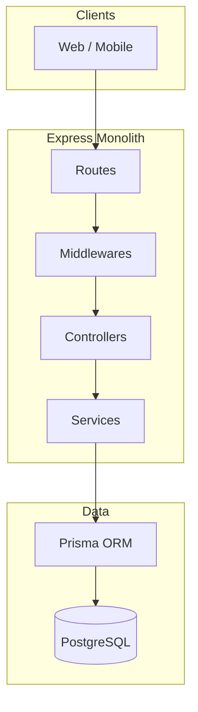
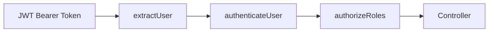

# Architecture Design

## High-level system architecture

## Monolith vs microservices

**Choice: Modular monolith (single Express application)**

| Factor | Monolith | Microservices |
|--------|----------|----------------|
| Team size | Fits MVP / assessment | Overhead for small team |
| Complexity | Single deploy, shared DB | Network, distributed transactions |
| Time to deliver | Faster | Slower for same scope |

**Why monolith:** The MVP requires coordinated rules (one active session, enrollment gates, daily limits, sponsorship links). A single codebase with clear modules (`services/`, `middlewares/`) keeps business rules consistent without cross-service calls.

**Future split (if scale demands):** Auth service, Session service, Billing service—bounded by `User`, `Session`, `Enrollment` aggregates.

## Roles and access control

| Role | Capabilities |
|------|----------------|
| **SUPERADMIN** | Seed-only account; create admins, organizations, sessions |
| **ADMIN** | Assigned to one active 30-day session; add videos/quizzes |
| **USER** | Register publicly; profile, enroll ($100), daily video/quiz |
| **ORGANIZATION** | Sponsor users for active session |

RBAC is enforced via:

1. `authenticateUser` — valid JWT required
2. `authorizeRoles(...)` — role whitelist per route
3. Domain middleware — `requireActiveSession`, `requirePaidEnrollment`, `requireProfileCompleted`

Public routes: health, register, login only.
